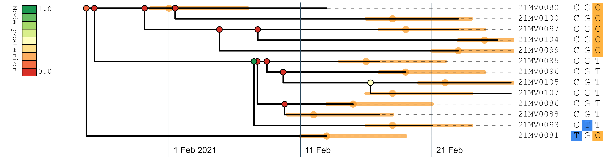

# PEACH Tree

## Plotting Epidemiological and Alignment CHaracters onto Trees

PEACH Tree is a web tool for rapidly visualising multiple sequence alignments, and is specifically designed for epidemiological domains, such as SARS-CoV-2 pathogen surveillance. 
By default, only segregating alignment sites (i.e. sites which vary among the samples) are displayed, making the program suitable for analysis of complete genomic data in a succinct format.
A phylogenetic tree can be generated from the alignment or uploaded separately.
Epidemiological annotations can be uploaded (such as symptom onset date) and viewed alongside the rest of the data.
PEACH Tree enables communication between genomic and epidemiological modelling efforts.

PEACH Tree runs in the web-browser at https://phylopeachtree.github.io/

